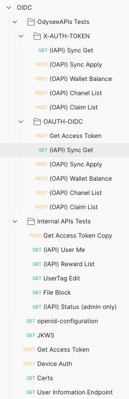

# oidc-examples
Postman examples for Odysee OIDC

Download [postman](https://www.postman.com/downloads/) 

## Import/Exports

Use the following links 

### [Importing](https://learning.postman.com/docs/getting-started/importing-and-exporting-data/#importing-data-into-postman)

### [Exporting](https://learning.postman.com/docs/getting-started/importing-and-exporting-data/#exporting-collections)

## Current Examples

## Environment

Importing the environment is similar to the collection. Once it is imported
there are specific values that are needed. 

1.  You will need a client created. Please reach out to the odysee team to get
your own client created for your use. 

2. If you are testing with the auth token of internal-apis you can get a token
[here](https://api.odysee.com/user/new)

3. To create a user account for OIDC logins you can create one 
[here](https://accounts.odysee.com)